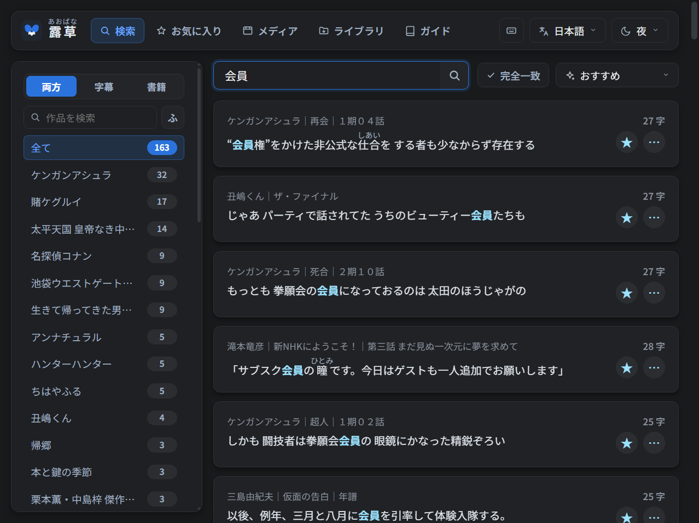
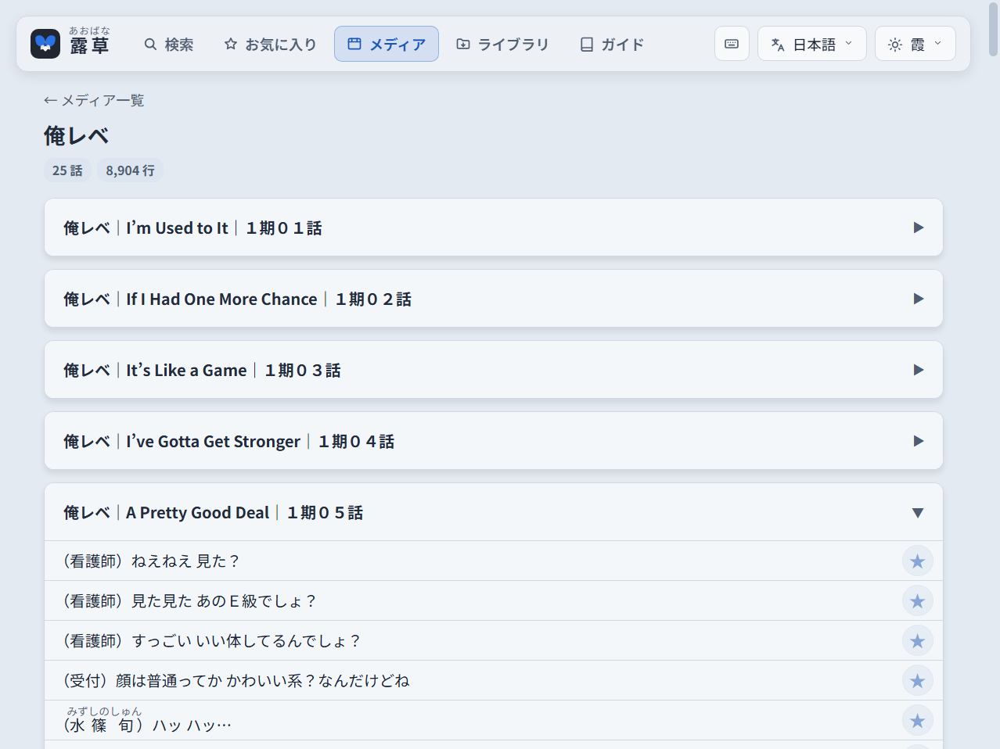

<p align="center">
  
</p>

<h1 align="center">露草 Aobana</h1>

<p align="center"><b>手持ちの字幕と電子書籍が、そのまま日本語の例文集に。</b></p>

<p align="center">
  <a href="https://github.com/Wyzmic/aobana/releases/latest"></a>
  <a href="LICENSE"></a>
</p>

<p align="center"><a href="README.md">English</a> | 日本語</p>

---

露草（あおばな）は、お手持ちの字幕ファイルや電子書籍から日本語の例文を探せる、オフラインの例文検索アプリです。
処理はすべてお使いのパソコンの中で完結し、インターネットにデータを送信することはありません（起動時に、新しいバージョンがあるかを GitHub に確認し、あればリリースページを案内するだけです）。



## 主な機能
- **自分だけのライブラリ** — 字幕（`.srt`・`.ass`・`.ssa`）と電子書籍（`.epub`）を、指定した2つのフォルダから取り込みます。`.ass` からは日本語の台詞だけを読み込みます（中国語・英語の行、看板、ルビ用の行、図形は除きます）。
- **活用形もまとめて検索** — `食べる` で検索すると「食べた」「食べて」もヒットし、読みの `たべる` でも探せます。完全一致検索や、`-` を付けた語の除外にも対応しています。
- **ふりがな** — すべての例文にふりがなを表示します。ルビ付きの書籍では、作者が振ったルビをそのまま使います。ボタン一つで非表示にもできます。
- **前後の文脈** — 例文の前後の台詞や文を確認できます。メディアタブでは、各話・各章を頭から通して読めます。
- **お気に入り・並べ替え・絞り込み** — 気に入った例文を保存できます。並び順は「おすすめ」「時系列順」「長い順」「短い順」「ランダム」から選べ、字幕だけ・書籍だけ・特定の作品だけに絞り込んで検索することもできます。
- **日本語・英語の表示切り替え**、4種類のテーマ、キーボードショートカットに対応。

## スクリーンショット
字幕と書籍をまとめて「帰る」で検索（テーマ「霞」）:


メディアタブで1話分を時系列順に読む:



## インストール（Windows 10 / 11、64ビット版）
1. [最新リリース](https://github.com/Wyzmic/aobana/releases/latest)から `Aobana-Setup-<バージョン>.exe` をダウンロードして実行します。コード署名をしていないため、「WindowsによってPCが保護されました」と表示されることがあります。その場合は「詳細情報」をクリックし、「実行」を押してください。
2. セットアップの案内に従います。Python などの必要なものはすべて同梱されているので、事前のインストールは不要で、オフラインでも動作します。
3. **Aobana** を起動すると、ブラウザで `http://127.0.0.1:5000/` が開きます。

フォルダはあとからセットアップをもう一度実行すれば変更できます。

## インストール（macOS、Apple シリコン）
1. [最新リリース](https://github.com/Wyzmic/aobana/releases/latest)から `Aobana-<バージョン>-macos-arm64.dmg` をダウンロードして開き、**Aobana** を「アプリケーション」フォルダにドラッグします。
2. Aobana を開きます。Apple の署名がないため、初回は macOS に開くのを止められます。「システム設定」›「プライバシーとセキュリティ」を開き、下のほうにある Aobana の「このまま開く」をクリックしてください（ターミナルで `xattr -dr com.apple.quarantine /Applications/Aobana.app` を実行しても開けるようになります）。
3. 露草はターミナルのウィンドウで起動し、ブラウザで `http://127.0.0.1:5005/` が開きます（macOS では 5000 番を AirPlay レシーバーが使っているため、5000 ではありません）。ターミナルのウィンドウを閉じると終了します。

ライブラリは `書類/Aobana/Subtitles` と `書類/Aobana/Books` に、データベースと設定は `~/Library/Application Support/Aobana` に置かれます。フォルダはライブラリタブから変更できます。Intel 搭載の Mac では、ソースから実行してください。

## インストール（Linux、x86-64）
[最新リリース](https://github.com/Wyzmic/aobana/releases/latest)には2種類あります。中身は同じです。どちらも自動でビルドとテストを行っています（Ubuntu 22.04・24.04、Fedora）が、実際の Linux デスクトップでの動作はまだ確認できていません。うまく動かない場合は [Issue](https://github.com/Wyzmic/aobana/issues) でお知らせください。
- **`Aobana-<バージョン>-linux-x86_64.tar.gz`**（おすすめ）: 展開したフォルダで `./install.sh` を実行します。アプリケーションメニューに **Aobana** が、コマンドとして `aobana` が追加されます。アップデートは新しいバージョンの `install.sh` を実行し、アンインストールは `~/.local/share/aobana-app/uninstall.sh` を実行します。
- **`Aobana-<バージョン>-x86_64.AppImage`**: ファイル1つで、インストールは不要です。実行可能にして（`chmod +x`）実行します。FUSE がないと表示された場合は、`--appimage-extract-and-run` を付けて実行してください。

露草はターミナルのウィンドウで動作し、そのウィンドウを閉じると終了します。ライブラリは `~/Documents/Aobana/Subtitles` と `~/Documents/Aobana/Books` に、データベースと設定は `~/.local/share/aobana` に置かれます。

## 使い方
1. **ファイルを置く** — 字幕は、字幕フォルダの中に作品ごとのフォルダを作って入れてください。フォルダ名がそのまま作品名になります。字幕フォルダの直下に置いた字幕ファイルは、ファイル名を作品名とする1つの作品として読み込まれます。書籍は書籍フォルダ内のどこに置いても構いません。
   ```
   字幕フォルダ/
   ├─ 作品A/
   │   ├─ 作品A S01E01.srt
   │   └─ 作品A S01E02.srt
   └─ 作品B/
       └─ 第1期/
           └─ 作品B 第01話.srt

   書籍フォルダ/
   └─ [著者名] 書名.epub
   ```
2. **インデックスを作成する** — ライブラリタブの「インデックス作成」を押します（字幕と書籍の両方、またはどちらか一方）。ファイルが増えるときは、作成前にデータベースの大きさと所要時間を見積もり、2つのデータベースの合計が 10 GB を超えそうな場合は確認します。2回目以降は、変更のあったファイルだけを処理します。
   同じタブの「点検する」は、日本語以外のファイルと重複（同じエピソードの別リッピング、SubPlz の出力一式、同じ本の別ファイル）を探します。チェックしたファイルはインデックスから外すだけで、移動も削除もせず、あとで戻せます。二か国語の字幕は日本語の部分だけがインデックスされます。
3. **検索する**

そのほかの使い方は、アプリ内のガイドタブで説明しています。露草の起動中は小さなコンソールウィンドウが開いており、このウィンドウを閉じると終了します。

## Android（Termux）
露草は Android スマートフォンでも動作し、端末のブラウザで開きます。Firefox なら、Yomitan などのポップアップ辞書と組み合わせて使うこともできます。

必要なもの:
- Termux と Termux:Widget（Google Play 版か [F-Droid](https://f-droid.org/packages/com.termux/) 版のどちらか。2つのアプリは必ず同じストアから入れてください。ストアが異なると連携できません）
- 約 1.5 GB の空き容量

1. **インストール** — 次のコマンドを Termux に貼り付けて実行し、ストレージへのアクセスを求められたら許可します。
   ```bash
   curl -fsSL https://raw.githubusercontent.com/Wyzmic/aobana/main/termux/install.sh | bash
   ```
   Termux 内に小さな Ubuntu 環境を用意し（形態素解析器の Sudachi に Android 版がないため）、そこに Python と、バージョンを固定したパッケージをインストールします。露草の動作に必要なファイルだけが `/storage/emulated/0/Aobana` に置かれ、Termux:Widget 用の **Aobana** ショートカットが追加されます。アップデートするときも、同じコマンドを実行するだけです。1.1 以降は、新しいバージョンが出るとページに「今すぐ更新」が表示され、押すだけで更新して再読み込みされます。
2. **ライブラリを用意する** — パソコン版の露草で作成した `subs.db` と `epub.db` を、上記のフォルダにコピーします（いちばん速く、検索結果もパソコンと同じになります）。または、そのフォルダの `content/Subtitles` と `content/Books` にファイルを入れ、ライブラリタブで「インデックス作成」を押します（スマートフォンでは時間がかかります）。
3. **起動する** — ホーム画面に Termux:Widget のウィジェットを追加し、**Aobana** をタップします。Firefox がインストールされていれば Firefox で、なければ既定のブラウザで開きます。ブラウザが開かない場合は、Android の設定で Termux の「他のアプリの上に重ねて表示」を許可してください。Termux を閉じると露草も終了します。

**アンインストール** — 露草用の Ubuntu 環境、ショートカット、露草のプログラムファイルを削除します。露草のフォルダにはデータベース、メディア、設定だけが残るので、不要であれば手動で削除してください。
```bash
curl -fsSL https://raw.githubusercontent.com/Wyzmic/aobana/main/termux/uninstall.sh | bash
```

## ソースから実行する（Windows・macOS・Linux）
リリース版は Python 3.14 でビルド・動作確認をしています。
```bash
git clone https://github.com/Wyzmic/aobana.git
cd aobana
pip install -r requirements.txt
python launcher.py
```
ソースから実行した場合、メディアフォルダはコードと同じ場所の `content/Subtitles` と `content/Books` になり、データベースもコードと同じ場所に作成されます。どちらのフォルダもライブラリタブから変更できます。

`requirements.txt` のバージョン指定は変えないでください。すべての文をどう区切ってインデックスするかは Sudachi の辞書で決まるため、辞書だけを更新すると検索結果が変わってしまいます。

Windows 用インストーラーを自分でビルドする手順は、`release/build.py` を参照してください。macOS 版と Linux 版は `release/build_unix.py` でビルドされ、GitHub のワークフローがこれを実行します。

## 追加のルビデータ
`data/ruby/` には、ふりがなを正しい文字の上に表示するための小さなタブ区切りの表が入っています。語全体にかかるルビや、書籍が括弧で示した読みのうち辞書で確認できたものなどです。自分で行を追加することもできます。読み込むには Aobana を再起動してください。

## ご要望・不具合の報告
追加してほしい機能のアイデアや、おかしな動作の報告を歓迎します。どちらも [Issue](https://github.com/Wyzmic/aobana/issues) からお知らせください。

## 謝辞
- [Nadeshiko](https://github.com/BrigadaSOS/Nadeshiko) — 多くの機能は、この例文検索サービスを参考にしています。
- [Sudachi](https://github.com/WorksApplications/sudachi.rs) とその辞書 — 形態素解析に使用しています。
- [Noto Sans JP](https://fonts.google.com/noto/specimen/Noto+Sans+JP) — 同梱のフォントです。

サードパーティ製ソフトウェアのライセンスは [THIRD_PARTY_NOTICES.md](THIRD_PARTY_NOTICES.md) に記載しています。

## 著作権について
- 露草には、字幕や書籍は一切含まれていません。お使いのパソコン内のファイルをインデックスするだけのアプリです。利用する権利のあるファイルでのみご利用ください。
- スクリーンショットでは、アプリの動作を紹介するために、作者自身のライブラリから短い台詞や文を数点引用しています。作品名および内容の権利は、各権利者に帰属します。
- 掲載内容の権利者の方で削除をご希望の場合は、[Issue](https://github.com/Wyzmic/aobana/issues) でお知らせください。該当の画像を差し替えます。
- 露草は、データの収集や外部への送信を一切行いません。

## ライセンス
[GPL-3.0](LICENSE)
