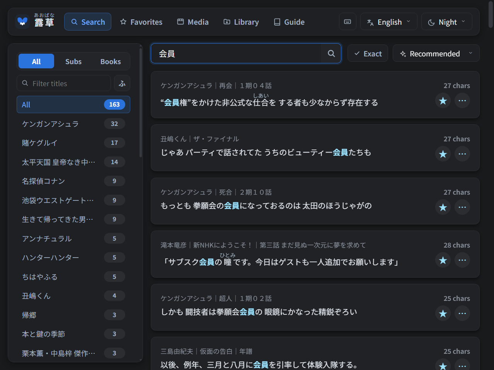
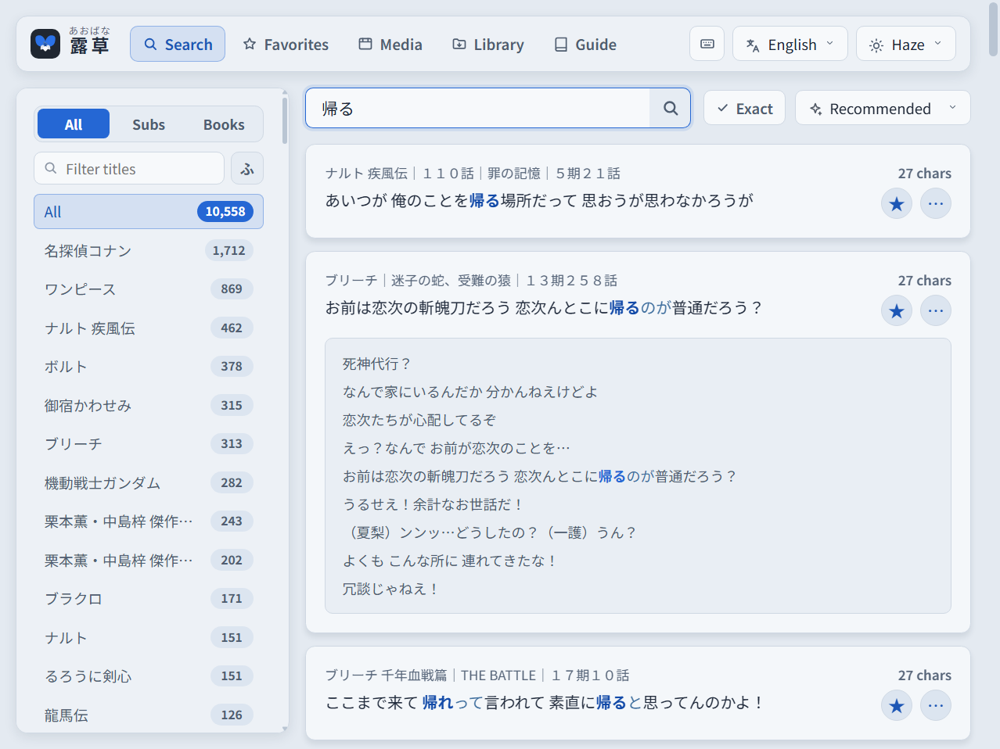
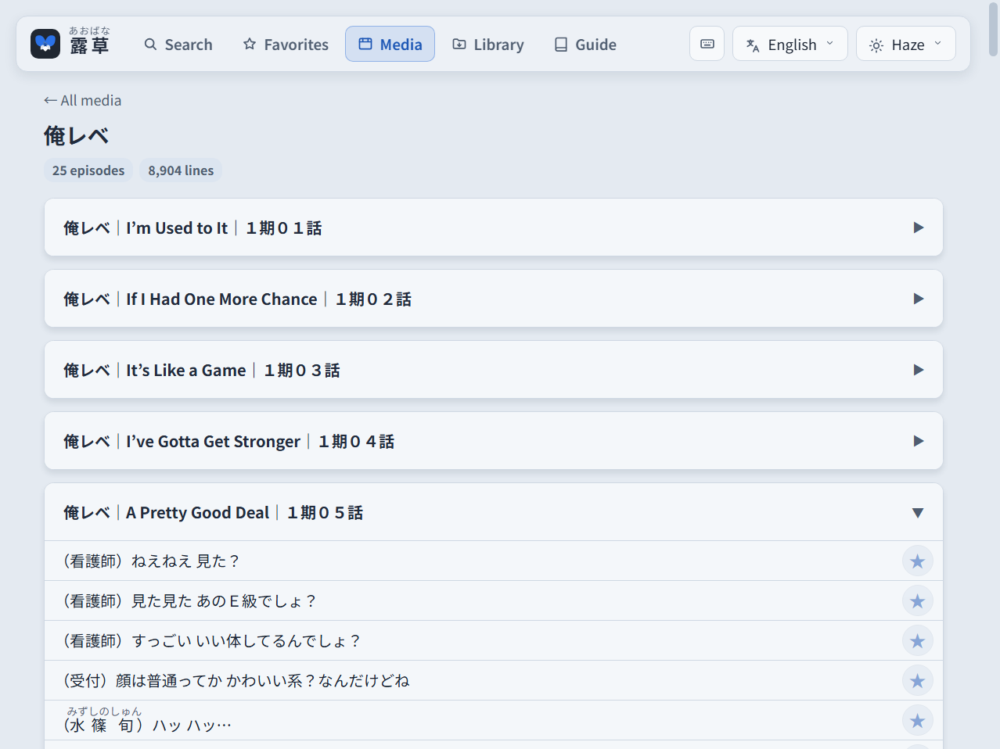

<p align="center">
  
</p>

<h1 align="center">露草 Aobana</h1>

<p align="center"><b>Japanese example sentences from the subtitles and e-books you already own.</b></p>

<p align="center">
  <a href="https://github.com/Wyzmic/aobana/releases/latest"></a>
  <a href="LICENSE"></a>
</p>

<p align="center">English | <a href="README.ja.md">日本語</a></p>

---

Aobana (露草, *あおばな*) is an offline search engine for Japanese example sentences, built from
the subtitle files and e-books you already own. Everything runs on your own computer and
nothing is sent to the internet: at start it only asks GitHub whether a newer version exists,
and if one does, it offers the release page.



## Features
- **Your own library:** subtitles (`.srt`) and e-books (`.epub`), indexed from two folders you choose.
- **Search that understands Japanese:** `食べる` also finds 食べた and 食べて, and the reading `たべる` works too. Exact matches, and excluding a word with `-`.
- **Furigana:** on every sentence, from the author's own ruby where the book has it. One click turns it off.
- **Context:** open the lines around any sentence, or read a whole episode or chapter in order from the Media tab.
- **Favorites, sorting and filters:** save sentences; sort them by recommended, chronological, longest, shortest or random; search subtitles, books or both, or inside a single title.
- **Japanese and English UI**, four themes, keyboard shortcuts.

## Screenshots
Searching for 帰る across subtitles and books, in the Haze theme, with the context open.



The Media tab, reading an episode in chronological order:



## Install (Windows 10 / 11, 64-bit)
1. Download `Aobana-Setup-1.0.exe` from the [latest release](https://github.com/Wyzmic/aobana/releases/latest).
2. Run it. The setup is not code-signed, so Windows SmartScreen may say *"Windows protected your PC"*: click **More info**, then **Run anyway**.
3. Pick the language, an install folder and your two media folders: keep the suggested new ones, or choose folders you already have. Leave one empty if you only have subtitles or only books, and set it later in the Library tab. Then choose where the index (the two databases) is kept: `%LOCALAPPDATA%\Aobana` by default, or a folder that already holds Aobana's databases. Running the setup again later shows the same pages with your current folders filled in, so you can change them. Python and everything else is included; nothing needs to be installed first, and it works offline.
4. Tick **Create a Start menu shortcut** or the desktop icon if you want one (both are off by default).
5. Start **Aobana** (`Aobana.exe` in the install folder, or the shortcut). It opens in your browser at `http://127.0.0.1:5000/`. If another program already uses port 5000, the setup offers a free port instead; the port can be changed later in the Library tab.

Uninstalling first asks what to delete besides the program: the settings and logs, the index in
`%LOCALAPPDATA%\Aobana`, and the suggested `Documents\Aobana` media folders, each shown with its
size. Tick everything to leave nothing behind, or keep what you want for a later reinstall.
Folders you chose yourself, for media or for the index, are never deleted. Rows you added to
`data\ruby` are part of the program folder, so they go with it.

## Usage
1. **Add files.** Give each show its own folder inside the subtitles folder: the folder's name becomes the show's name, and a `.srt` placed directly in the subtitles folder is not read. Books can go anywhere in the books folder.
   ```
   Subtitles folder/
   ├─ Show A/
   │   ├─ Show A S01E01.srt
   │   └─ Show A S01E02.srt
   └─ Show B/
       └─ Season 1/
           └─ Show B 第01話.srt

   Books folder/
   └─ [Author] Title.epub
   ```
2. **Build the index.** Press **Index library** in the Library tab. The first run over a large library takes a few minutes; later runs only process files that changed.
3. **Search.**

The Guide tab explains the rest. Aobana runs in a small console window; close it to quit.

## Android (Termux)
Aobana runs on an Android phone and opens in your browser there, so a pop-up dictionary such as Yomitan works on it in Firefox. It needs Termux and Termux:Widget, from Google Play or [F-Droid](https://f-droid.org/packages/com.termux/) (both apps from the same store: builds from different stores cannot work together), and about 1.5 GB free.

1. **Install** — paste this into Termux, and allow storage access when asked:
   ```bash
   curl -fsSL https://raw.githubusercontent.com/Wyzmic/aobana/main/termux/install.sh | bash
   ```
   It sets up a small Ubuntu inside Termux (the Sudachi analyzer has no Android build), installs Python and the pinned packages there, puts the files Aobana runs from (nothing else) in `/storage/emulated/0/Aobana`, and adds an **Aobana** shortcut for the Termux:Widget widget. Run the same command again to update.
2. **Add your library** to that folder: copy `subs.db` and `epub.db` from a computer where Aobana has indexed it (fastest, and identical results), or put files in `content/字幕` and `content/書籍` there and press **Index library** in the Library tab (slow on a phone).
3. **Start** — add the Termux:Widget widget to your home screen and tap **Aobana**. The page opens in Firefox if it is installed, otherwise in your default browser. If no browser opens, allow Termux *Display over other apps* in Android's settings. Closing Termux stops Aobana.

**Uninstall** — removes Aobana's Ubuntu, the shortcut and the app's files; in the Aobana folder only your databases, media and settings stay, for you to delete if you no longer want them:
```bash
curl -fsSL https://raw.githubusercontent.com/Wyzmic/aobana/main/termux/uninstall.sh | bash
```

## Run from source (Windows, Linux)
Python 3.14 is what the release is built and tested with.
```bash
git clone https://github.com/Wyzmic/aobana.git
cd aobana
pip install -r requirements.txt
python launcher.py
```
From a source folder, the media folders are `content/字幕` and `content/書籍` beside the code, and the databases are written next to it. You can point both folders elsewhere from the Library tab. The pins in `requirements.txt` matter: the Sudachi dictionary decides how every sentence is indexed, so do not upgrade it on its own.

To build the Windows installer yourself, see `release/build.py`.

## Extra ruby data
`data/ruby/` holds a few tab-separated tables that help Aobana draw furigana over the right characters, such as words whose ruby covers the whole word, and readings a book gives in parentheses that a dictionary confirms. You can add your own rows; restart Aobana to load them.

## Suggestions and bug reports
Ideas for what to add are welcome, and so are reports of anything that looks wrong. Open an
[issue](https://github.com/Wyzmic/aobana/issues) for either.

Already planned: **more subtitle formats**. Only `.srt` is read today; `.ass` / `.ssa`, the
format most anime subtitles come in, is next.

## Acknowledgements
- [Nadeshiko](https://github.com/BrigadaSOS/Nadeshiko), whose sentence search inspired many of these features.
- [Sudachi](https://github.com/WorksApplications/sudachi.rs) and its dictionary, for the morphological analysis.
- [Noto Sans JP](https://fonts.google.com/noto/specimen/Noto+Sans+JP), the bundled font.

Third-party licenses are listed in [THIRD_PARTY_NOTICES.md](THIRD_PARTY_NOTICES.md).

## Copyright
- Aobana includes no subtitles and no books. It indexes files on your own computer; use it only with files you have the right to use.
- The screenshots quote a few short lines from the author's own library to show how the app works. The titles shown belong to their rights holders.
- If you hold the rights to something shown and want it removed, [open an issue](https://github.com/Wyzmic/aobana/issues) and the image will be replaced.
- Aobana collects nothing and sends nothing: it runs only on your computer.

## License
[GPL-3.0](LICENSE)
